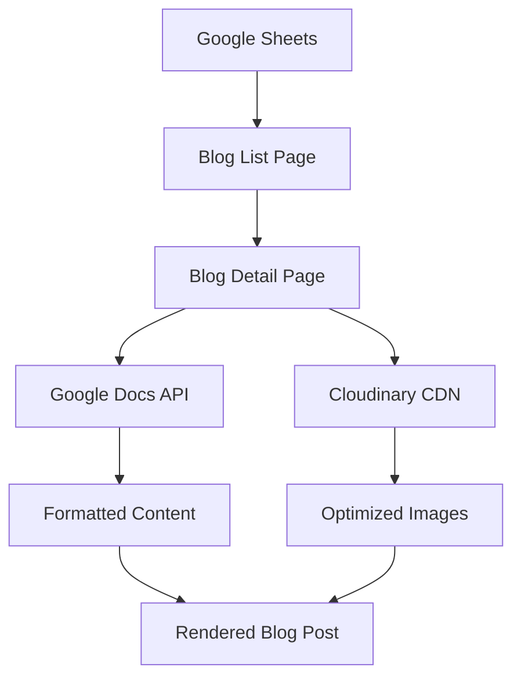

# Auto-Blog Module Architecture

## System Overview

The Auto-Blog Module is a three-tier system that separates content management, content storage, and content delivery for maximum flexibility and scalability.



## Core Components

### 1. Content Management Layer (Google Sheets)

**Purpose**: Centralized content scheduling and metadata management

**Functionality**:
- Blog post metadata (title, dates, categories)
- Content and image URL references
- Publishing schedule management
- Status tracking (approved/draft)

**Benefits**:
- Non-technical content management
- Real-time updates via API
- Collaborative editing
- Version control

### 2. Content Storage Layer (Google Docs)

**Purpose**: Rich text content creation and storage

**Functionality**:
- Full blog article content with formatting
- WYSIWYG editing experience
- Export to HTML for web display
- Collaborative writing and editing

**Benefits**:
- Familiar editing interface
- Rich text formatting
- Comment and suggestion system
- Easy content updates

### 3. Image Optimization Layer (Cloudinary)

**Purpose**: Optimized image delivery and transformation

**Functionality**:
- Automatic image optimization
- Responsive image generation
- Format conversion (WebP, AVIF)
- CDN delivery for performance

**Benefits**:
- Fast loading times
- Bandwidth optimization
- Multiple device support
- Automatic format selection

### 4. Frontend Presentation Layer

**Purpose**: User-facing blog interface

**Components**:
- **Blog List Component**: Displays all published posts
- **Blog Detail Component**: Shows individual post content
- **Content Service**: Handles API integrations
- **Image Service**: Manages image optimization

## Data Flow

### 1. Content Creation Workflow

```
1. Create blog post entry in Google Sheets
2. Write article content in Google Docs
3. Upload/reference images in Cloudinary
4. Set publish date in Google Sheets
5. Mark as "Approved" in Google Sheets
6. Content automatically appears on website
```

### 2. Frontend Data Flow

```
1. User visits blog page
2. Frontend fetches post list from Google Sheets
3. Posts filtered by publish date (past/present only)
4. User clicks on individual post
5. Frontend fetches Google Docs content via export API
6. Images loaded via optimized Cloudinary URLs
7. Content rendered with styling and formatting
```

### 3. API Integration Points

#### Google Sheets API
- **Endpoint**: `https://sheets.googleapis.com/v4/spreadsheets/{SHEET_ID}/values/{RANGE}`
- **Method**: GET
- **Auth**: API Key
- **Fallback**: CSV export for non-API usage

#### Google Docs Export
- **Endpoint**: `https://docs.google.com/document/d/{DOC_ID}/export?format=html`
- **Method**: GET
- **Auth**: None (public docs)
- **Processing**: HTML cleanup and styling

#### Cloudinary Images
- **Endpoint**: `https://res.cloudinary.com/{CLOUD}/image/upload/{TRANSFORMATIONS}/{IMAGE}`
- **Method**: GET
- **Optimization**: Automatic format and quality selection

## Technical Architecture

### File Structure

```
src/
├── components/
│   ├── Blog.js                 # Blog listing component
│   ├── BlogPost.js             # Individual post component
│   └── BlogPost.css            # Post styling
├── services/
│   ├── googleSheetsService.js  # Sheets API integration
│   └── contentService.js       # Content fetching and processing
└── assets/
    └── images/                 # Default/fallback images
```

### Key Functions

#### GoogleSheetsService
```javascript
- fetchBlogPostsFromSheet()     # API method
- fetchBlogPostsFromCSV()       # Fallback method
- isPostVisible(postDate)       # Date filtering
```

#### ContentService
```javascript
- fetchGoogleDocsContent(url)   # Fetch and process docs
- getOptimizedImageUrl(url)     # Image optimization
- extractGoogleDocId(url)       # URL processing
```

## Security Considerations

### API Keys
- Google Sheets API key stored in environment variables
- No server-side authentication required
- Read-only access to public sheets

### Content Security
- Google Docs must be publicly readable
- Images served via HTTPS CDN
- No sensitive data in public sheets

### Performance Optimizations
- Client-side caching of fetched content
- Lazy loading of images
- Fallback mechanisms for API failures

## Scalability Features

### Multi-Client Support
- Template-based implementation
- Configurable styling variables
- Modular component structure
- Environment-based configuration

### Content Management
- Unlimited blog posts via sheets
- Batch content operations
- Automated publish scheduling
- Content approval workflow

### Performance
- CDN delivery for all assets
- Optimized image serving
- Minimal JavaScript bundle size
- Progressive loading strategies

## Error Handling

### API Failures
1. Primary: Google Sheets API
2. Fallback: CSV export
3. Final fallback: Hardcoded placeholder

### Content Loading
- Graceful degradation for missing content
- Loading states for slow connections
- Error messages for failed requests
- Retry mechanisms for transient failures

## Deployment Considerations

### Environment Setup
- API keys configuration
- Build process integration
- Static hosting compatibility
- CDN configuration

### Monitoring
- API usage tracking
- Error rate monitoring
- Performance metrics
- Content update notifications